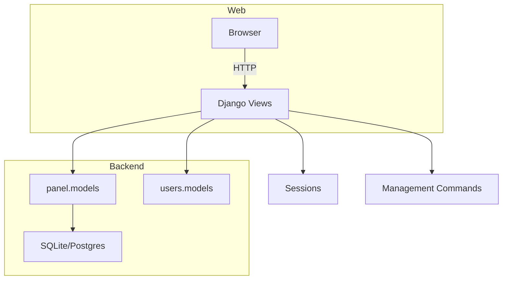

# 🧭 Concave Insights — Referral Tracking Dashboard


## 📋 Table of Contents

- Overview
- Features
- Architecture
- Technology Stack
- Installation & Quickstart
- Management Commands
- Project Structure
- Data Model Summary
- Tests
- Deployment
- Contributing
- License

## 🌟 Overview

Concave Insights is a Django-based referral tracking dashboard for a consumer
panel. It captures referral links, attributes signups to referrers using
session-backed referral codes, and exposes admin views for search, filtering,
and payout tracking.

### Mission

Make referral attribution reliable and auditable while providing admins a
compact interface to monitor respondents and referral progress.

## ✨ Features

- Session-based referral attribution via short referral URLs
- Self-referential `Respondent` model to build referral trees
- Respondent lifecycle states: `lead`, `fit`, `completion`
- Admin views: search, filters, list display and bulk actions
- Management command: `load_baseline_data` to import initial respondents

## 🏗 Architecture



## 🛠 Technology Stack

- Python 3.11+
- Django 5.x
- SQLite (dev) / PostgreSQL (prod)
- Bootstrap 5 for templates
- Django REST Framework (optional for APIs)

## 🚀 Installation & Quickstart

### Prerequisites

- Python 3.11+
- Git

### 1) Clone repository

```bash
git clone https://github.com/YOUR_USERNAME/concave-referral-tracker.git
cd concave-referral-tracker
```

### 2) Create & activate virtualenv

```bash
python -m venv venv
# Windows
venv\Scripts\activate
# macOS / Linux
source venv/bin/activate
```

### 3) Install dependencies

```bash
pip install -r requirements.txt
```

### 4) Setup database & load baseline data

```bash
python manage.py migrate
python manage.py load_baseline_data
```

### 5) Create admin user & run server

```bash
python manage.py createsuperuser
python manage.py runserver
```

Open http://localhost:8000 for the dashboard and
http://localhost:8000/admin for admin pages.

## ⚙️ Management Commands

- `python manage.py load_baseline_data` — import `data/baseline_respondents.csv`
- `python manage.py migrate` — apply DB migrations
- `python manage.py createsuperuser` — create admin account

## 📁 Project Structure

```
d:/Refferal-tracking-dashboard
├── config/               # Django settings, urls, wsgi, asgi
├── data/                 # Baseline CSVs and fixtures
├── panel/                # Core app: models, views, admin, management
├── templates/            # HTML templates for dashboard and signup
├── users/                # User models and views
├── manage.py
├── requirements.txt
└── README.md
```

For full layout, see `panel/` and `users/` directories.

## 🧾 Data Model Summary

- `Respondent` — contact info, `referral_code`, `referred_by` (self FK), `status`, `cool_off_until`
- `ReferralStatus` — links referrer→referred, `stage`, `bonus_amount`, `is_paid`

See `panel/models.py` and `users/models.py` for field-level details.

## ✅ Tests

Run Django tests:

```bash
python manage.py test
```

## 📦 Deployment Notes

- Use PostgreSQL in production and set `DEBUG=False`.
- Run `python manage.py collectstatic` if serving static files.
- Use a WSGI/ASGI server (Gunicorn, Daphne) behind Nginx.

## 🤝 Contributing

1. Fork the repo
2. Create a branch: `git checkout -b feature/my-feature`
3. Commit changes: `git commit -m "feat: ..."`
4. Push and open a PR

Please include tests for new behavior and keep PRs focused.

## 📄 License

Add a license file to the repository (e.g., MIT) or update this section.

---
This README was updated to mirror the CureConnect layout and style.
---
Updated README generated to reflect repository structure and usage.
