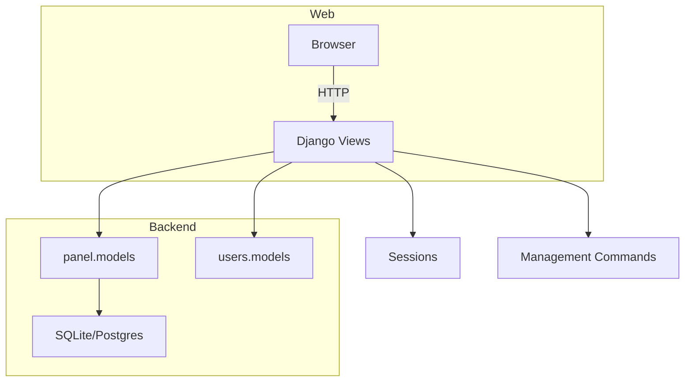
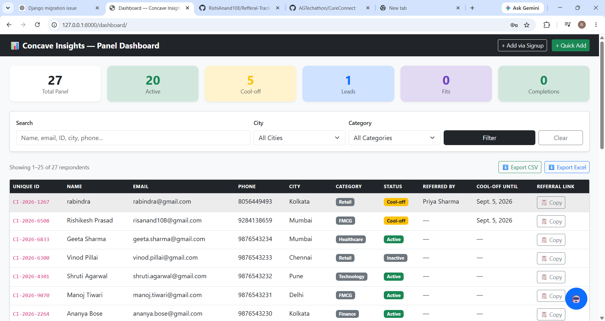
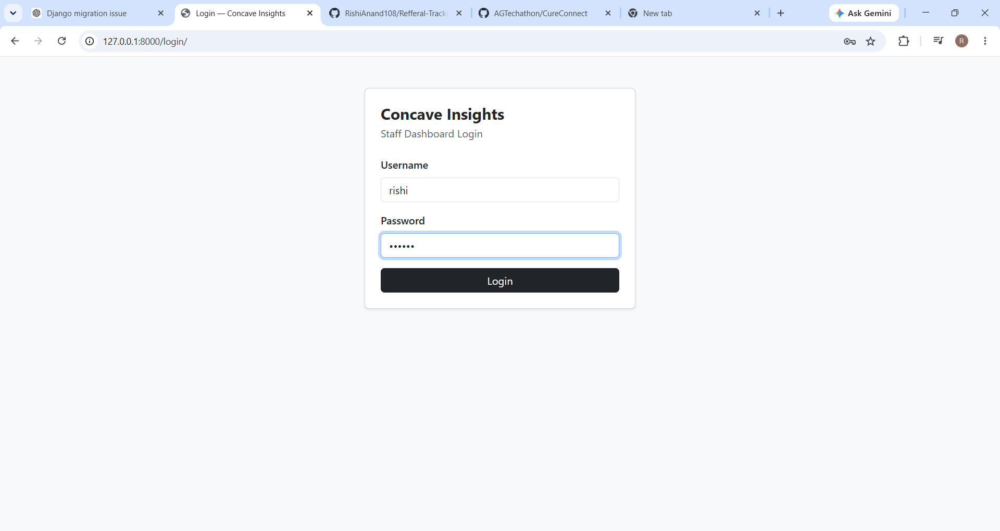
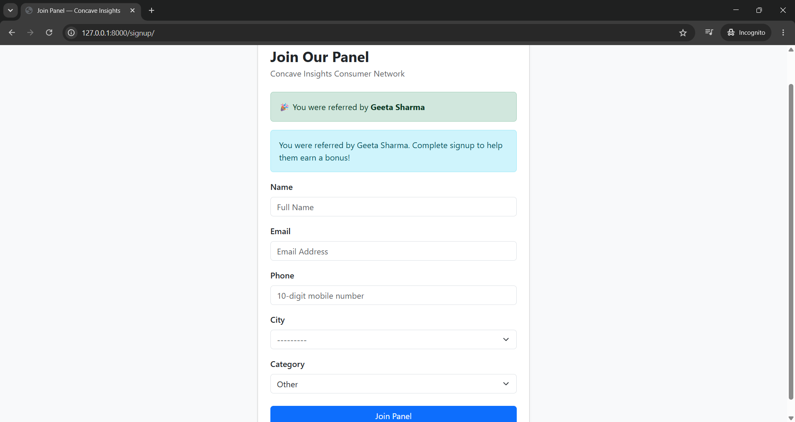
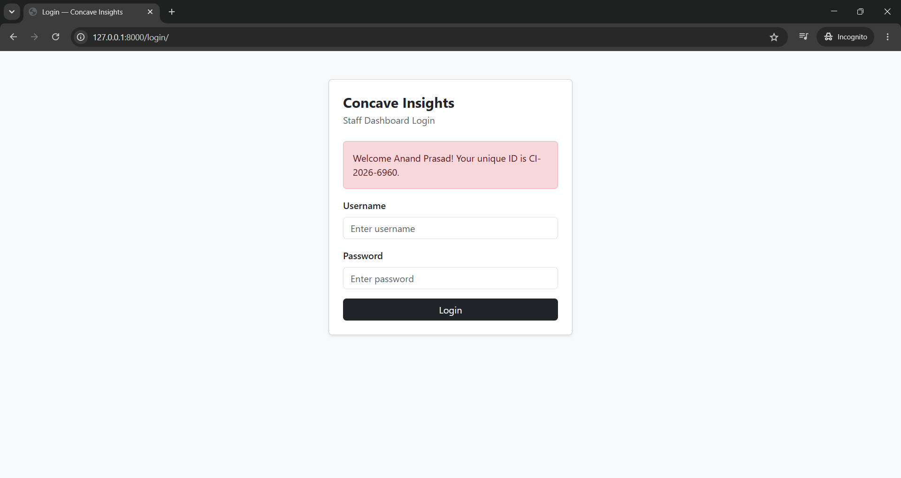
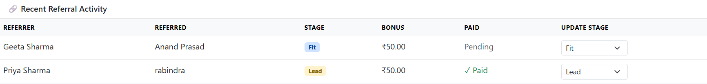
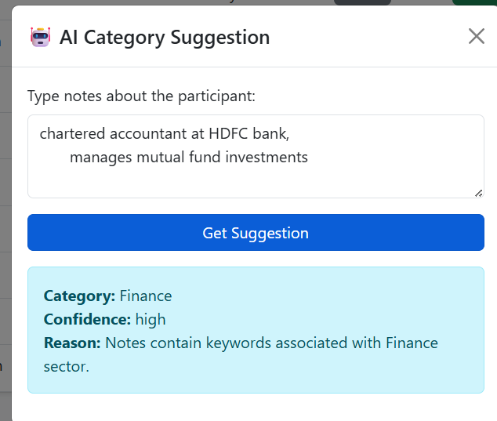

# 🧭 Concave Insights — Referral Tracking Dashboard


## 📋 Table of Contents

- Overview
- Features
- Architecture
- Technology Stack
- Installation & Quickstart
- Management Commands
- Project Structure
- Data Model Summary
- Tests
- Deployment
- Contributing
 - Deployment
 - Contributing

## 🌟 Overview

Concave Insights is a Django-based referral tracking dashboard for a consumer
panel. It captures referral links, attributes signups to referrers using
session-backed referral codes, and exposes admin views for search, filtering,
and payout tracking.

### Mission

Make referral attribution reliable and auditable while providing admins a
compact interface to monitor respondents and referral progress.

## ✨ Features

- Session-based referral attribution via short referral URLs
- Self-referential `Respondent` model to build referral trees
- Respondent lifecycle states: `lead`, `fit`, `completion`
- Admin views: search, filters, list display and bulk actions
- Management command: `load_baseline_data` to import initial respondents

## 🏗 Architecture



## 🛠 Technology Stack

- Python 3.11+
- Django 5.x
- SQLite (dev) / PostgreSQL (prod)
- Bootstrap 5 for templates
- Django REST Framework (optional for APIs)

## 🚀 Installation & Quickstart

### Prerequisites

- Python 3.11+
- Git

### 1) Clone repository

```bash
git clone https://github.com/YOUR_USERNAME/concave-referral-tracker.git
cd concave-referral-tracker
```

### 2) Create & activate virtualenv

```bash
python -m venv venv
# Windows
venv\Scripts\activate
# macOS / Linux
source venv/bin/activate
```

### 3) Install dependencies

```bash
pip install -r requirements.txt
```

### 4) Setup database & load baseline data

```bash
python manage.py migrate
python manage.py load_baseline_data
```

### 5) Create admin user & run server

```bash
python manage.py createsuperuser
python manage.py runserver
```

Open http://localhost:8000 for the dashboard and
http://localhost:8000/admin for admin pages.

## ⚙️ Management Commands

- `python manage.py load_baseline_data` — import `data/baseline_respondents.csv`
- `python manage.py migrate` — apply DB migrations
- `python manage.py createsuperuser` — create admin account

## 📁 Project Structure

```
Concave-Insights/                      # Referral Tracking Dashboard
├── config/                            # Django project settings, ASGI/WGSI, URLs
│   ├── __init__.py
│   ├── settings.py
│   ├── urls.py
│   ├── wsgi.py
│   └── asgi.py
├── panel/                             # Core app: respondents, referrals, admin
│   ├── admin.py
│   ├── apps.py
│   ├── models.py
│   ├── views.py
│   ├── forms.py
│   ├── utils.py
│   ├── management/                    # custom management commands
│   │   └── commands/
│   └── migrations/
├── users/                             # user models, auth-related views
│   ├── admin.py
│   ├── models.py
│   ├── views.py
│   └── migrations/
├── templates/                         # HTML templates (panel/, users/)
├── data/                              # baseline CSVs and fixtures
├── assets/                            # images and screenshots
│   └── screenshots/                   # embedded README screenshots
├── manage.py
├── requirements.txt
└── README.md

```

This layout mirrors a clear separation between project-level configuration
(`config/`), the main Django apps (`panel/`, `users/`), and static project
assets and documentation.

## 🧾 Data Model Summary

- `Respondent` — contact info, `referral_code`, `referred_by` (self FK), `status`, `cool_off_until`
- `ReferralStatus` — links referrer→referred, `stage`, `bonus_amount`, `is_paid`

See `panel/models.py` and `users/models.py` for field-level details.

## ✅ Tests

Run Django tests:

```bash
python manage.py test
```

## 📦 Deployment Notes

- Use PostgreSQL in production and set `DEBUG=False`.
- Run `python manage.py collectstatic` if serving static files.
- Use a WSGI/ASGI server (Gunicorn, Daphne) behind Nginx.

## 🤝 Contributing

1. Fork the repo
2. Create a branch: `git checkout -b feature/my-feature`
3. Commit changes: `git commit -m "feat: ..."`
4. Push and open a PR

Please include tests for new behavior and keep PRs focused.

---
## 📷 Screenshots












## 🔁 Workflow — How the project works (step-by-step)

This section explains the user and admin flows from first visit to logout.

### 1) Public referral link visit

- A referrer shares a short referral link: `https://.../refer/<code>/`.
- When a new user visits that link, the system stores the referrer's ID
    in the visitor's session (cookie-based). The visitor sees the signup
    page with a banner: "You were referred by <Referrer Name>".

### 2) Signup (Join Panel)

- The visitor fills the signup form (`/signup/`) with name, email,
    phone, city and category.
- Server-side validation ensures unique email/phone and enforces
    the 3-month cool-off rule.
- On successful signup, the new `Respondent` is created, `referred_by`
    is set from the stored session data, and a `ReferralStatus` record is
    created with stage `lead` and `is_paid = False`.
- The signup page shows a confirmation with the generated unique ID.

### 3) Respondent lifecycle & status updates

- Respondents progress through stages: `lead` → `fit` → `completion`.
- Admins update stages via the dashboard (list or detail views). When
    stage becomes `completion`, the referral bonus becomes payable.
- `ReferralStatus` stores `bonus_amount` and `is_paid` to record payouts.

### 4) Admin login & dashboard

- Staff users log in at `/login/` (staff dashboard). After login they see
    the dashboard with summary cards (Total, Active, Cool-off, Leads,
    Fits, Completions) and a searchable, filterable respondent table.
- The admin can:
    - Search by name/email/ID/phone/city
    - Filter by city and category
    - Export respondents as CSV/Excel
    - Quickly add a respondent via the quick-add modal
    - Open AI suggestions modal for category when notes are provided

### 5) Referral activity and payouts

- The Recent Referral Activity panel shows referrer, referred person,
    stage, bonus and paid status with an inline control to update stage.
- When `is_paid` is toggled, the system records payout details (admin
    should reconcile payments externally). Optionally, you can extend
    the app to integrate with a payments provider to automate payouts.

### 6) Logout

- Staff users can log out from the top-right menu which ends the session
    and redirects to the public homepage or login screen.

<p align="center">Built with ❤️ by rishi</p>


